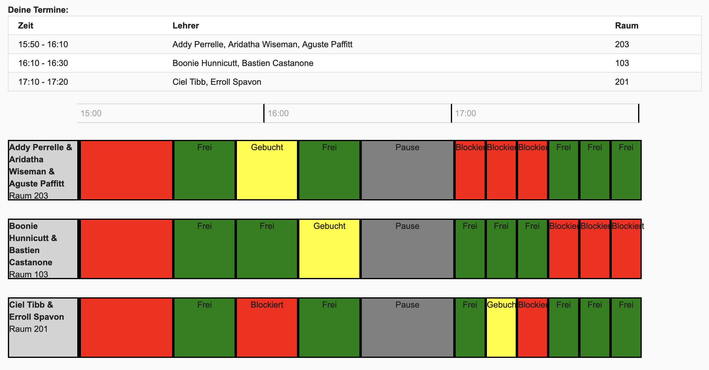
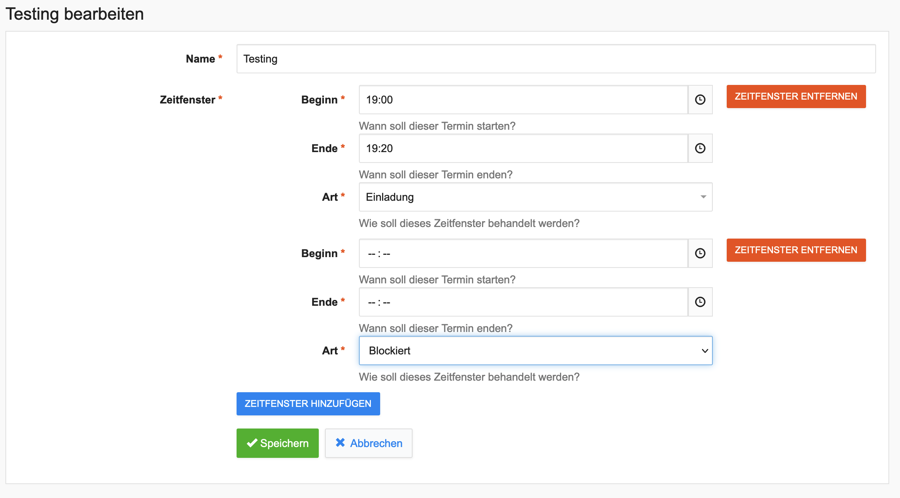

# Elternsprechtagsterminvereinbarung für IServ
[/statusIcon)](https://teamcity.joethei.xyz/viewType.html?buildTypeId=Studium_Programming_DigiHelferElternsprechtag&guest=1)

|Buchung|Bearbeitung|Ausdruck|
:-------:|:--------:|:------:|
 | |

Entstanden als Projektarbeit im Rahmen des [DigiHelfer](https://www.hs-emden-leer.de/studierende/fachbereiche/technik/projekte/neo-mint/digihelfer) Projekts der Hochschule Emden/Leer

## Dokumentation
[Dokumentation als Projektarbeit](https://pdf.joethei.space/Abgaben/Projektarbeit/index.pdf)

## Installation
> ⚠️ Am besten nicht im laufenden Schulbetrieb, weil während der Installation die Weboberfläche zeitweise nicht erreichbar ist.

Auf der Server Konsole als **root** folgende Befehle ausführen:

```bash
wget https://f.joethei.space/keys/public.key
apt-key add public.key
echo "deb https://nexus.joethei.xyz/repository/apt stable main" > /etc/apt/sources.list.d/digihelfer.list
apt update
```


Kann nun in IServ unter *Verwaltung > System > Pakete* gefunden und
installiert werden.

Nach der Installation müssen einige Daten manuell in die Datenbank
eingetragen werden.
Dazu per `psql` auf der Datenbank anmelden und folgende Befehle ausführen.
```sql
\c iserv
INSERT INTO espt_eventType (name) VALUES ('invite') ON CONFLICT (name) DO NOTHING;
INSERT INTO espt_eventType (name) VALUES ('book') ON CONFLICT (name) DO NOTHING;
INSERT INTO espt_eventType (name) VALUES ('blocked') ON CONFLICT (name) DO NOTHING;
INSERT INTO espt_eventType (name) VALUES ('break') ON CONFLICT (name) DO NOTHING;
```

## Privilegien
- Als Schüler an Elternsprechtagen teilnehmen
- Als Lehrkraft an Elternsprechtagen teilnehmen
- Verwaltung von Elternsprechtagen

## Konfiguration
- Erlaube Bearbeitung durch Lehrkräfte
- Erlaube Mehrfachbuchungen
- Erlaube zeitliche Überlappung