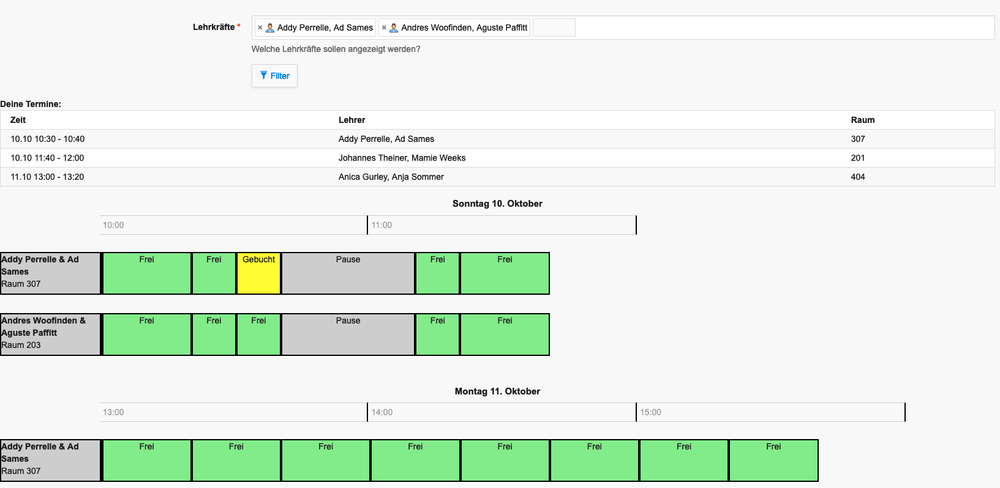
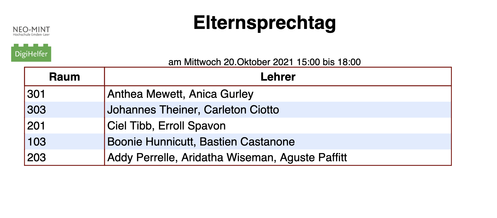

# Elternsprechtagterminvereinbarung für IServ
[/statusIcon)](https://teamcity.joethei.xyz/viewType.html?buildTypeId=Studium_Programming_DigiHelferElternsprechtag&guest=1)

⚠️**In Entwicklung, nicht für den Produktivbetrieb geeignet**

|Buchung|Bearbeitung|Ausdruck|
:-------:|:--------:|:------:|
 | |

Entstanden als Projektarbeit im Rahmen des [DigiHelfer](https://www.hs-emden-leer.de/studierende/fachbereiche/technik/projekte/neo-mint/digihelfer) Projekts der Hochschule Emden/Leer

## Dokumentation
[Dokumentation für Nutzer & Administratoren](https://pdf.joethei.space/Abgaben/Projektarbeit/documentation.pdf)

[Dokumentation als Projektarbeit](https://pdf.joethei.space/Abgaben/Projektarbeit/index.pdf)

## Installation
⚠️ Am besten nicht im laufenden Schulbetrieb, weil während der Installation die Weboberfläche zeitweise nicht erreichbar ist.

Auf der Server Konsole als ``root`` folgende Befehle ausführen:
```
wget -O public.key https://joethei.space/index.php/s/LTPCNbcmX2gPXX6/download
apt-key add public.key
echo "deb https://nexus.joethei.xyz/repository/apt stable main" > /etc/apt/sources.list.d/digihelfer.list
apt update
```

Kann nun in IServ unter `Verwaltung > System > Pakete` gefunden werden und
installiert werden.